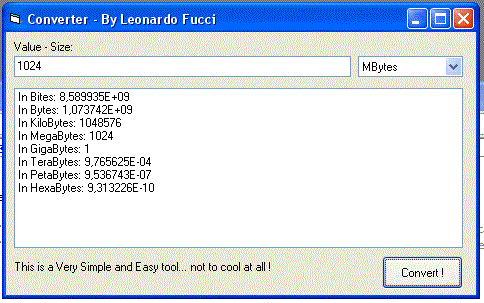



## \[    A Bit Mega Byte Bytes Gigas Terras Converter to \.\.\.    \]

### Description

You enter a Number, select the Scale (Megas, Gigas, Teras, Petas, Hexas) and the programm shows you the values in diferents measures.
 
### More Info
 
A value + A Scale

www.meetfinder.ar.tc !

A value in all the scales

             |
---                |---
**Submitted On**   |2004-06-21 03:33:08
**By**             |[FUCCI, Leonardo Hernan](https://github.com/Planet-Source-Code/PSCIndex/blob/master/ByAuthor/fucci-leonardo-hernan.md)
**Level**          |Beginner
**User Rating**    |3.0 (12 globes from 4 users)
**Compatibility**  |VB 4\.0 \(32\-bit\), VB 5\.0, VB 6\.0, VB Script
**Category**       |[Math/ Dates](https://github.com/Planet-Source-Code/PSCIndex/blob/master/ByCategory/math-dates__1-37.md)
**World**          |[Visual Basic](https://github.com/Planet-Source-Code/PSCIndex/blob/master/ByWorld/visual-basic.md)
**Archive File**   |[\[A\_Bit\_Meg1759946212004\.zip](https://github.com/Planet-Source-Code/fucci-leonardo-hernan-a-bit-mega-byte-bytes-gigas-terras-converter-to__1-54514/archive/master.zip)

### API Declarations

www.meetfinder.ar.tc !

